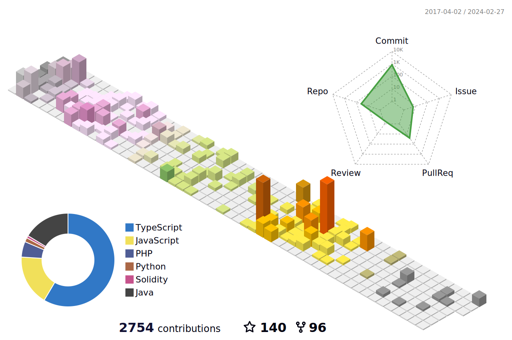

<h1 align="center">
  Welcome to my GitHub.
</h1>
<h3 align="center">
  I am a AI & Blockchain Developer.
</h3>

  

 

<h3 align="center"> Tech & Tools</h3>

 
 <table align="center">
  <tr>
    <td align="center" width="90">
      
       Rust
    </td>
    <td align="center" width="90">
      
       Solidity
    </td>
    <td align="center" width="90">
      
       React
    </td>
    <td align="center" width="90">
      
       Next.js
    </td>
    <td align="center" width="90">
      
       Ethereum
    </td>
    <td align="center" width="90">
      
       Solana
    </td>
    <td align="center" width="90">
      
       Angular
    </td>
    <td align="center" width="90">
      
       Express
    </td>
    <td align="center" width="90">
      
       Laravel
    </td>
    <td align="center" width="90">
        
       AWS
    </td>
  </tr>
  <tr>
    <td align="center" width="90">
      
       Javascript
    </td>
    <td align="center" width="90">
      
       Typescript
    </td>
    <td align="center" width="90">
      
       PHP
    </td>
      <td align="center" width="90">
        
       Go
    </td>
    <td align="center" width="90">
      
       Python
    </td>
    <td align="center" width="90">
      
       MongoDB
    </td>
    <td align="center" width="90">
      
       MySQL
    </td>
    <td align="center" width="90">
      
       PostgreSQL
    </td>
    <td align="center" width="90">
      
       SQLite
    </td>
    <td align="center" width="90">
      
       Supabase
    </td>
  </tr>
  <tr>
    <td align="center" width="90">
        
       GraphQL
    </td>
    <td align="center" width="90">
      
       Android
    </td>
    <td align="center" width="90">
      
       MaterialUI
    </td>
    <td align="center" width="90">
      
       Tailwind
    </td>
    <td align="center" width="90">
        
       Docker
    </td>
    <td align="center" width="90">
      
       Three.js
    </td>
    <td align="center" width="90">
      
       NFT
    </td>
    <td align="center" width="90">
      
       DeFi
    </td>
    <td align="center" width="90">
      
       Vue
    </td>
    <td align="center" width="90">
      
       Nuxt.js
    </td>
  </tr>
</table>

  

 

 

  

 
<h1>
   Skills
</h1>

<table>
  <thead>
    <tr>
      <th>Languages</th>
      <th>Frameworks and Libraries</th>
      <th>Databases</th>
    </tr>
  </thead>
  <tbody>
    <tr>
      <td>
        

            
        

      </td>
      <td>
        

          
        

      </td>
      <td>
        

          
        

      </td>
    </tr>
  </tbody>
</table>

  

